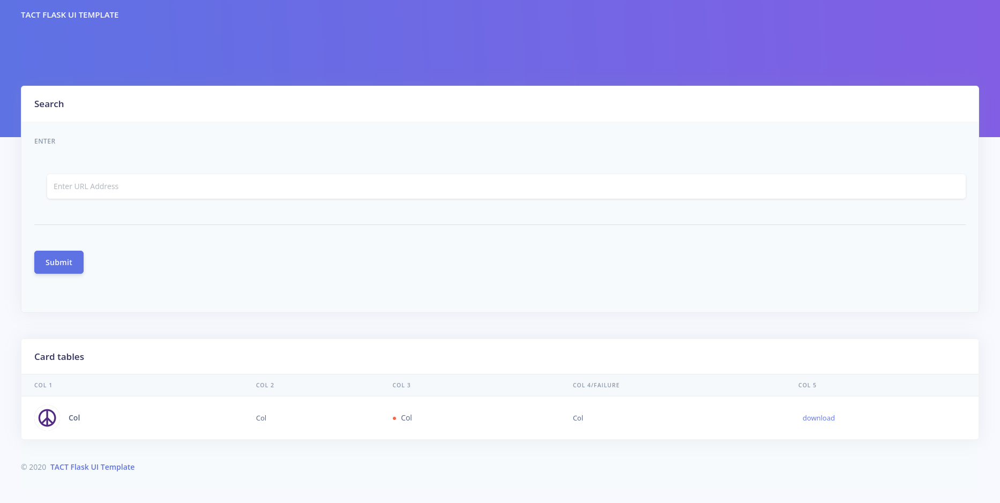

## TACT Flask UI Template

### Install requirements
```
pip install -r requirements.txt
```

### Run Luigi in a separate terminal
```
luigid
```

### Run application
```
python application.py
```

### Screenshot
